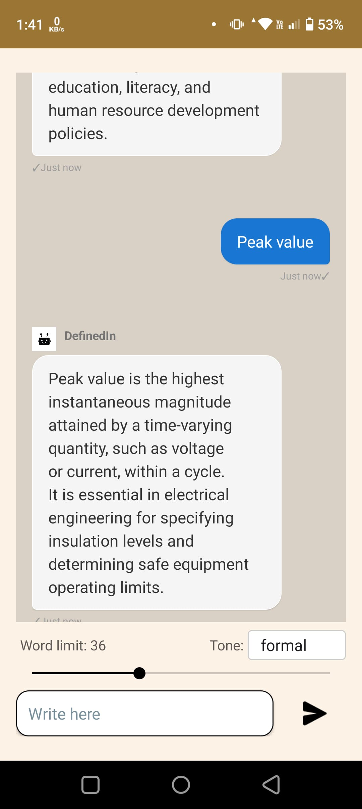

# DefinedIn-Application

## Overview
DefinedIn is a lightweight, user-friendly Android dictionary application that allows users to look up word definitions with customizable tone and length preferences. The app provides definitions in various styles, from formal academic definitions to more humorous or casual explanations.





## Features

- **Word Definition Lookup**: Instantly search for definitions of any word
- **Adjustable Definition Length**: Control how detailed you want the definition to be with a simple slider
- **Multiple Tone Options**: Get definitions in different tones:
  - Neutral - Standard dictionary-style definition
  - Formal - Academic and professional tone
  - Informal - Casual and conversational explanation
  - Humorous - Light-hearted and entertaining definition
  - Serious - Detailed, thorough explanation
- **Clean and Intuitive UI**: Simple, distraction-free interface designed for quick lookups
- **Chat-Style Interface**: View your word lookup history in a convenient chat format

## Technical Details

### Architecture
- Built with native Android components
- Uses OkHttp for network requests
- Implements RecyclerView for the chat-style interface
- Material Design components for UI elements

### API Integration
The app connects to a custom dictionary API service hosted at: `https://define-i05a.onrender.com/api/define`

API parameters:
- `word`: The word to define (URL encoded)
- `length`: Maximum word limit for the definition (1-250)
- `lang`: Language code (default: "eng")
- `tone`: Tone setting (neutral, formal, informal, humorous, serious)

### Requirements
- Android 5.0 (Lollipop) or higher
- Internet connection required for definitions

## Getting Started

### Installation
1. Download the APK from the releases page
2. Enable installation from unknown sources in your device settings if needed
3. Install and launch the application

### Development Setup
1. Clone this repository
```bash
git clone https://github.com/mananjay-prasad/defindin.git
```

2. Open the project in Android Studio

3. Sync Gradle files and build the project

4. Run on an emulator or physical device

## Usage

1. Enter a word in the text field at the bottom of the screen
2. Adjust the word limit slider to control definition length
3. Select your preferred tone from the dropdown menu
4. Tap the send button to get the definition
5. View the definition in the chat interface
6. Continue looking up more words as needed

## Libraries Used

- OkHttp: For handling API requests
- RecyclerView: For displaying the chat interface
- Material Components: For UI elements like TextInputEditText

## Future Enhancements

- Offline dictionary support
- Word history and favorites
- Multiple language support
- Dark mode
- Text-to-speech integration
- Example sentences

## Contributing

Contributions are welcome! If you'd like to contribute:

1. Fork the repository
2. Create a feature branch (`git checkout -b feature/amazing-feature`)
3. Commit your changes (`git commit -m 'Add amazing feature'`)
4. Push to the branch (`git push origin feature/amazing-feature`)
5. Open a Pull Request


## Acknowledgements

- Dictionary API service provided by [https://define-i05a.onrender.com/api/docs/]
- Design made by [https://claude.ai/chat/48c31ed0-8f99-4ea2-bc23-74766542468e]
